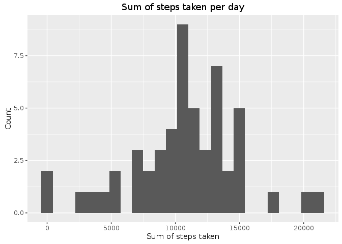
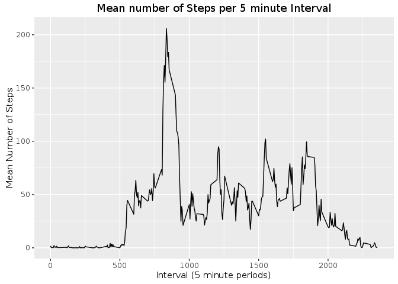
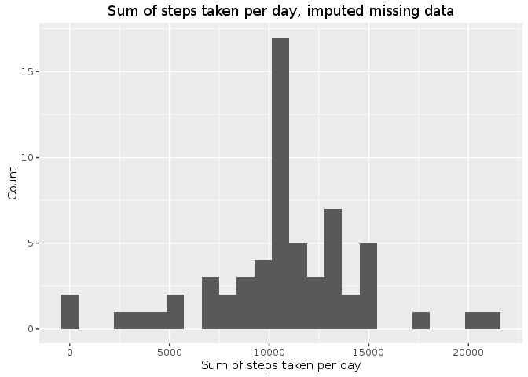
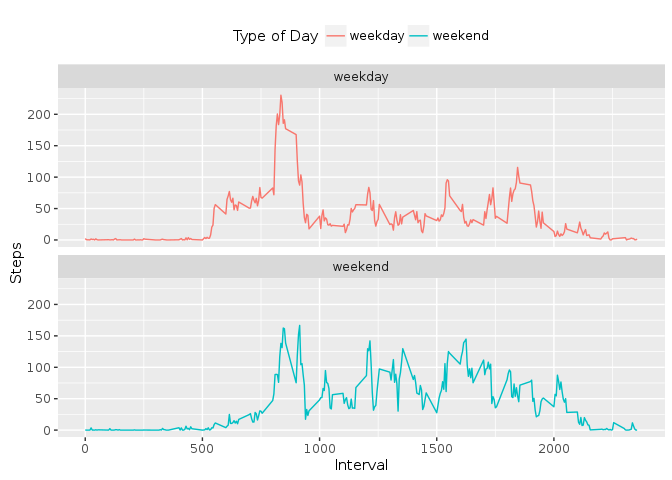

# Reproducible Research: Peer Assessment 1


## Loading and preprocessing the data

The data will be processed using `dplyr` and `data.table`, along with `lubridate` and `ggplot2` for graphics.


```r
library(data.table)
library(dplyr)
library(lubridate)
library(ggplot2)

if (!file.exists('activity.csv'))
  unzip('activity.zip')

data <- fread('activity.csv')
dpd <- tbl_df(data)
```

## What is mean total number of steps taken per day?

For the time being, remove `NA` values.


```r
noNil <- filter(dpd, !is.na(steps))
```

Calculate the sum of all steps in the data set.

```r
sum(noNil$steps)
```

```
## [1] 570608
```

Next, group the data after applying `lubridate` to get date objects. Sum the steps after grouping.

```r
grped <- noNil %>%
  mutate(dto = ymd(date)) %>%
  group_by(dto)
summed <- summarize(grped, sum(steps))
```

Create a histogram with the sum of steps by day and their counts in the data set.


```r
ggplot(data = summed, 
               aes(summed$`sum(steps)`)) +
  geom_histogram(bins = 25) + 
  labs(x = "Sum of steps taken",
       y = "Count",
       title = "Sum of steps taken per day")
```

<!-- -->

Calculate the mean and median sum of steps per day.

```r
mean(summed$`sum(steps)`)
```

```
## [1] 10766.19
```

```r
median(summed$`sum(steps)`)
```

```
## [1] 10765
```

## What is the average daily activity pattern?

Calculate the mean number of steps per interval.

```r
meanSteps <- noNil %>% 
  group_by(interval) %>% 
  summarize(mean(steps))
```

Graph the above.


```r
ggplot(meanSteps, 
                aes(x = interval,
                    y = `mean(steps)`)) +
  labs(x = "Interval (5 minute periods)",
       y = "Mean Number of Steps",
       title = "Mean number of Steps per 5 minute Interval") +
  geom_line()
```

<!-- -->

Find the interval with the maximum mean steps across all days.


```r
filter(meanSteps, 
       `mean(steps)` == max(`mean(steps)`))
```

```
## Source: local data frame [1 x 2]
## 
##   interval mean(steps)
##      <int>       <dbl>
## 1      835    206.1698
```

## Imputing missing values

Show number of rows with `NA` steps. 

```r
count(filter(dpd, is.na(steps)))
```

```
## Source: local data frame [1 x 1]
## 
##       n
##   <int>
## 1  2304
```

To impute the missing values, we will use the average steps per interval across all days to fill in the `NA` values from the original data set. Then, ungroup the data and add the `lubridate` date to the data.


```r
nonNils <- dpd %>% 
  group_by(interval) %>% 
  mutate(steps = ifelse(is.na(steps), 
                        mean(steps, na.rm=TRUE), steps)) %>% 
  ungroup %>%
  mutate(dto = ymd(date))
```

Group the data by the `lubridate` date, then sum the data.


```r
nonNilsSummed <- nonNils %>%
  group_by(dto) %>%
  summarize(sum(steps))
```

Create a histogram with the new data set, without `NA` values.

```r
ggplot(data = nonNilsSummed, 
                     aes(`sum(steps)`)) +
  geom_histogram(bins = 25) + 
  labs(x = "Sum of steps taken per day",
       y = "Count",
       title = "Sum of steps taken per day, imputed missing data")
```

<!-- -->

Calculate mean and median of the non-`NA` data.

```r
mean(nonNilsSummed$`sum(steps)`)
```

```
## [1] 10766.19
```

```r
median(nonNilsSummed$`sum(steps)`)
```

```
## [1] 10766.19
```

The mean increased slightly with non-`NA` data, while the median remained the same.

While the shape of the two data sets is appears approximately the same, many more data points are binned in the second plot's histogram, consistent with the new data that was added by replacing `NA` values with the mean of the interval across all days.

## Are there differences in activity patterns between weekdays and weekends?

Create a function that will label weekend  days appropriately.

```r
isWeekendDay <- function(x) {
  x == "Sunday" | x == "Saturday"
}
```

Add the `weekendLabel` factor using the function above, then group the data by `interval` and `weekdayLabel` for processing.

```r
nonNilsWithWeekendLabel <- nonNils %>%
  mutate(weekendLabel = factor(ifelse(isWeekendDay(weekdays(dto)), 
                                      "weekend", 
                                      "weekday"))) %>%
  group_by(interval, weekendLabel) %>%
  summarize(mean(steps))
```

Plot weekend activity alongside weekday activity.


```r
ggplot(nonNilsWithWeekendLabel, 
                      aes(x=interval,
                          y=`mean(steps)`,
                          col = weekendLabel)) +
  labs(x="Interval",
       y="Steps",
       col = "Type of Day") +
  theme(legend.position = "top") +
  facet_wrap(~ weekendLabel, ncol = 1) + 
  geom_line()
```

<!-- -->
